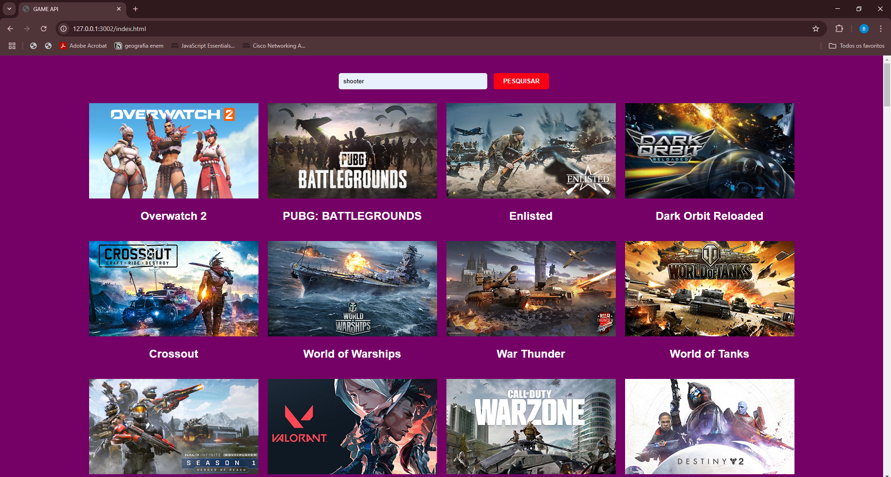

### ATIVIDADE: CRIANDO API - FRONT-END

---

## Sobre 
Atividade da disciplina de Front-End, elaborada com o objetivo de colocar em pratica os conhecimentos adquiridos  nas aulas de FrontEnd, aplicando Api pública pela primeria vez no curso de Desenvolvimento de Sistemas do [SENAI Jandira](https://sp.senai.br/unidade/jandira/).

---
## Tecnologias utilizadas
- JS
- HTML
- CSS
- MarkDown
- Git

---
## Autor
- [Beatriz Boletini](https://github.com/boletini)

